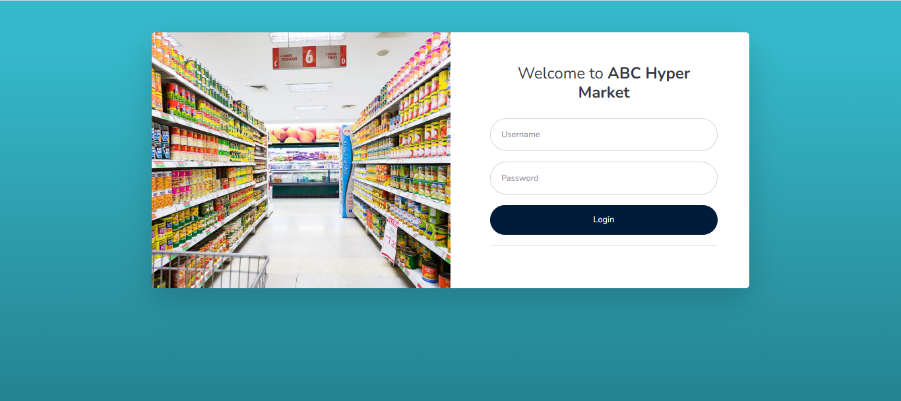
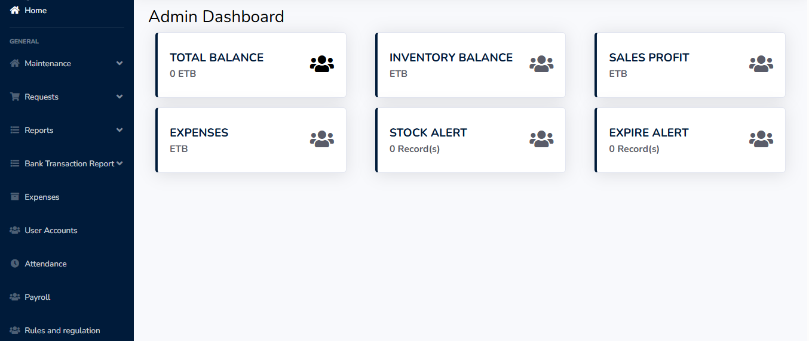
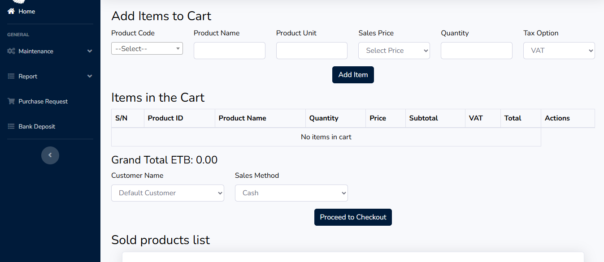

# 🛒 Hypermarket Inventory Management System (FIFO-Based)

A robust web-based Inventory Management System specifically designed for hypermarkets. This system uses **FIFO (First-In, First-Out)** logic to manage product stock, track multi-price purchases, and calculate accurate profits. It also integrates **expense tracking** and a **role-based workflow** to ensure secure, authorized, and well-managed operations.

---

## 📌 Purchase Approval Workflow (Role-Based Hierarchy)

The inventory system ensures tight control over purchasing with a multi-step, role-based approval process:

1. **Product Request**
   - Any employee can request products to be purchased.

2. **Admin Approval**
   - The request is reviewed and approved by the **Admin**. Without admin approval, the process stops.

3. **Purchase Admin Review**
   - After admin approval, the **Purchase Admin** reviews the request and forwards it to the appropriate **Purchase Staff**.

4. **Vendor Price Submission**
   - The **Purchase Staff** visits suppliers and records current product prices. These are submitted to the **Accountant** for financial review.

5. **Accountant Approval**
   - The **Accountant** verifies the proposed purchase prices and gives final approval for purchase.

6. **Product Purchase**
   - Only after all necessary approvals are completed, the purchase is officially executed, and stock is updated.

---

## 📘 Project Background (STAR Method)
- **S – Situation**
In the operation of a medium-sized supermarket, the team faced several challenges related to inventory and financial management:

  -- Products were often purchased at varying prices on different dates, making it difficult to determine true profit margins.

  -- Purchases were sometimes made without proper authorization, leading to financial leakage and accountability issues.

  -- The business incurred recurring expenses (e.g., electricity, water, rent), but these were not factored into profit analysis.
  
  -- Most critically, during **six-month and annual reporting periods**, the staff was required to physically count all remaining product stock to estimate asset values for the balance sheet and financial statements. This manual stock counting was tedious, error-prone, and time-consuming, especially with hundreds of product items in stock.

There was an urgent need for an automated inventory management system that would not only track stock in real time but also generate accurate reports for financial auditing purposes.

- **T – Task**
I was assigned to design and develop a comprehensive, centralized Inventory Management System that would:
  -- Implement FIFO (First-In, First-Out) logic to accurately calculate cost of goods sold.
  
  -- Track multiple purchase prices per product.
  
  -- Support a secure, role-based purchase approval workflow.
  
  -- Automatically calculate net profit by factoring in operational expenses.
  
  -- Handle VAT options (15%, 2%, or none).
  
  -- Automate six-month and annual stock reporting, reducing the burden of manual counting.
  
  -- Provide essential financial documents like balance sheets and profit/loss statements with real-time inventory valuation.

- **A – Action**
I developed the system using:
  -- Frontend: HTML, CSS, JavaScript, and Bootstrap
  
  -- Backend: PHP
  
  -- Database: MySQL

Key system modules I implemented include:
  -- A products table with SKU, stock quantity, and unit pricing.
  
  -- A purchases table that logs every stock-in record, including price, quantity, and date.
  
  -- A FIFO stockout mechanism that calculates which batch is sold first, ensuring cost accuracy.
  
  -- A sales module that determines real-time profit using FIFO purchase prices.
  
A multi-step approval workflow **(Role-Based Hierarchy)**:
  -- Any staff member can request a product.
  
  -- The **Admin**reviews and approves the request.
  
  -- The **Purchase Admin** assigns the task to a Purchase Staff.
  
  -- The **Purchase Staff** visits suppliers and records current product prices. These are submitted to the **Accountant** for financial review.
  
  -- The **Accountant** reviews and approves the purchase before it proceeds.
  
  -- Only after all necessary approvals are completed, the purchase is officially executed, and stock is updated.
  
  -- An expense tracker for overhead costs.

An automated financial reporting engine that:
  -- Calculates net profit after expenses.
  
  -- Provides real-time inventory valuation for semi-annual and annual financial reports.
  
  -- Generates balance sheets and profit/loss statements without the need for manual stock counting.

- **R – Result**
The completed system delivered major improvements to the supermarket’s operations:

  ✅ Replaced manual product counting during reporting periods with real-time inventory valuation, saving days of labor and improving financial accuracy.
  
  ✅ Enforced purchase discipline by requiring both Admin and Purchase Admin approval.
  
  ✅ Provided true profit analysis by including both FIFO-based cost and operational expenses.
  
  ✅ Allowed easy compliance with VAT and financial regulations.
  
  ✅ Increased accountability across departments through role-based dashboards.
  
  ✅ Enabled fast and accurate generation of financial statements, balance sheets, and stock valuation reports.

The system now plays a central role in daily operations and financial planning. It has been packaged and prepared for public release on GitHub to help other businesses facing similar challenges.

> 🔒 **Security Rule:**  
> No product is allowed to be purchased without approval from both **Admin** and **Purchase Admin**. This ensures transparency and financial discipline.

## 🚀 Key Features

✅ **FIFO-Based Stock Management**  
Track products purchased at different prices and automatically sell the oldest stock first (FIFO logic), ensuring accurate cost and profit calculations.

✅ **Role-Based Access Control**  
Includes defined roles: `Admin`, `Purchase Admin`, `Accountant`, `Purchase Staff`, and `Sales Staff`, each with specific responsibilities.

✅ **Purchase Approval Workflow**  
Structured multi-level approval ensures that no product is purchased without the authorization of both Admin and Purchase Admin.

✅ **Point of Sale (POS)**  
Simple and clean POS interface for processing sales with real-time inventory updates and profit tracking.

✅ **Expense Tracking**  
Log daily/monthly expenses like electricity, rent, water, etc., and subtract them from gross profit to calculate net profit.

✅ **VAT Support**  
Supports various VAT options (15%, 2%, or none) for both purchases and sales.

✅ **Profit Reporting**  
Generates detailed profit & loss reports using FIFO purchase costs, VAT, and operating expenses.
## 📸 Sample Pages
-Login Page
-Admin Page
-Sales Page

## 👨‍💼 Author
- **Kehali Tsehay**
- Kehalits@gmail.com | https://www.linkedin.com/in/kehali-tsehay
 
## 📃 License
- MIT License

Copyright (c) 2025 Kehali Tsehay
